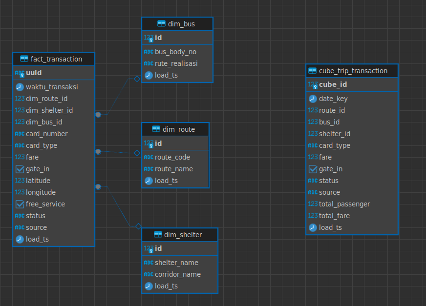
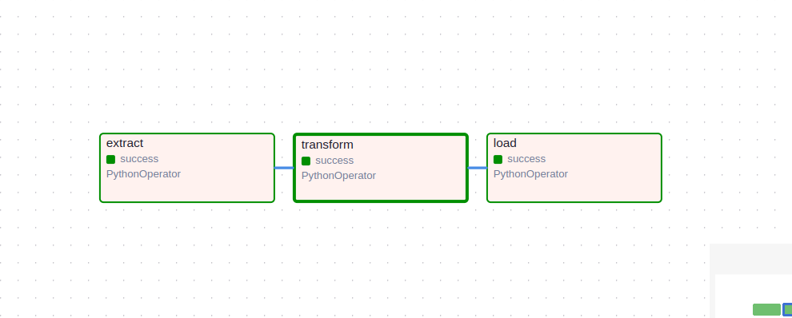

# 🚍 Transjakarta ETL Pipeline – Airflow, Docker, PostgreSQL

This project implements an automated **daily ETL pipeline** for processing Transjakarta operational data using **Apache Airflow**, **Docker Compose**, and **PostgreSQL**.  
It follows the technical test requirements for building a complete Extract → Transform → Load workflow that cleans raw data, aggregates key metrics, and loads the results into a PostgreSQL data warehouse.

---

## 📌 Project Overview

### **1️⃣ Extract**
- Loads **5 input tables**:
  - `routes.csv`
  - `shelter_corridor.csv`
  - `realisasi_bus.csv`
  - PostgreSQL tables: `transaksi_bus`
  - PostgreSQL tables: `transaksi_halte`
- Reads CSV files from `./data/`.

### **2️⃣ Transform**
- Cleans and standardizes data:
  - Removes duplicates
  - Normalizes bus body number format → `AAA-000`
  - Converts timestamps
  - Filters customer records (`status_var = 'S'`)
- Joins:
  - Route master
  - Shelter corridor
  - Bus data
  - Transaction data
- Computes aggregations:
  - Customer count & amount per **card type**
  - Customer count & amount per **route**
  - Customer count & amount per **fare**

### **3️⃣ Load**
- Writes final dataset to:
  - PostgreSQL table: `dw.cube_trip_transaction`
  - CSV report at: `./reports/cube_report_YYYY-MM-DD.csv`

### **4️⃣ Schedule**
- DAG runs every day at **07:00 (Asia/Jakarta)**.

---

## 🧱 Data Architecture & Pipeline Overview
### **Star Schema**



### **Airflow DAG Snapshot**


### **ETL Flow Diagram**
(Insert your ETL flow image)


## 🛠️ Technology Stack
1. Docker & Docker Compose – Container orchestration for Airflow and PostgreSQL.

2. Apache Airflow 2.10.2 – Workflow orchestration (Webserver, Scheduler, LocalExecutor).

3. PostgreSQL 16 – Main database for Airflow + transjakarta schemas (raw, staging, dw).

4. Python (Airflow image) – ETL processing using Pandas, SQLAlchemy, and psycopg2.

5. Mounted Directories –

    - dags/ → Airflow DAGs
    - data/ → Input CSV files
    - sql_scripts/ → SQL transformations & cube builder
    - reports/ → Output CSV reports
    - logs/ → Airflow logs

## 📂 Project Structure

```
├── dags/
│   ├── etl.py                  # Main DAG (Extract → Transform → Load)
│   └── helper/
│       ├── build_dw.py         # Build dimensions & cube
│       ├── cleaning.py         # Cleaning functions
│       ├── report.py           # CSV export
│       ├── upsert.py           # Upsert helper
│       └── utils.py
│
├── data/                       # Input CSVs (5 files)
├── reports/                    # Auto-generated output CSVs
├── sql_scripts/                # SQL for building schemas, cube, dims
├── postgres_init/              # Auto-init PostgreSQL schemas
├── docker-compose.yaml         # Full Airflow + Postgres stack
└── README.md

```

## ▶️ How to Run the Project
### 1. Clone Repository
    git clone <repo_url>
    cd etl-transjakarta


### 2. Update Folder Permissions (for Unix Systems)
    sudo chmod -R 777 ./dags
    sudo chmod -R 777 ./sql_scripts
    sudo chmod -R 777 ./data
    sudo chmod -R 777 ./reports

### 3. Start the Airflow & Postgres Stack
    docker-compose up -d


Access Airflow UI:

🔗 http://localhost:8080

    User: admin
    Password: admin


### 4. Add Airflow Connections
Enter the running Airflow webserver container:

    docker exec -it airflow_webserver bash

Then register the database connections:

**RAW Layer**

    airflow connections add 'pg_raw' \
        --conn-type 'postgres' \
        --conn-login 'airflow' \
        --conn-password 'airflow' \
        --conn-host 'postgres' \
        --conn-port '5432' \
        --conn-schema 'transjakarta' \
        --conn-extra '{"options": "-c search_path=raw"}'

**STAGING Layer**

    airflow connections add 'pg_staging' \
        --conn-type 'postgres' \
        --conn-login 'airflow' \
        --conn-password 'airflow' \
        --conn-host 'postgres' \
        --conn-port '5432' \
        --conn-schema 'transjakarta' \
        --conn-extra '{"options": "-c search_path=staging"}'

**DATA WAREHOUSE Layer**

    airflow connections add 'pg_dw' \
        --conn-type 'postgres' \
        --conn-login 'airflow' \
        --conn-password 'airflow' \
        --conn-host 'postgres' \
        --conn-port '5432' \
        --conn-schema 'transjakarta' \
        --conn-extra '{"options": "-c search_path=dw"}'

Exit the container:
    
    exit

### 5. Trigger the DAG

Open Airflow UI:

👉 http://localhost:8080

1. Go to DAGs
2. Find tj_transaction_pipeline
3. Click Trigger DAG

This will run:

1. Extract
2. Transform
3. Load into PostgreSQL (DW)
4. Generate CSV report

## 📄 Output Files & Tables
1. Data Warehouse Table
```bash
dw.cube_trip_transaction
```
2. Daily CSV Report
```bash
./reports/cube_report_YYYY-MM-DD.csv
```
